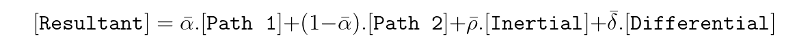

# Path Merger
This repository contains a ROS 2 package that merges two distinct planned path using weighted vector addition and publishes the computed merged path to a new topic. The algorithm is developed using C++ in combination with ROS 2 and using RViz as a visualization environment.

## Description

**Objective:** To perform merging of two input paths into a single, continuous path such that a smooth transitioning between the input paths is ensured and the merged path respects the nature of the original paths.

**System Info:** This package was tested on Ubuntu Linux 20.04 with ROS 2 Foxy.

## Nodes
This package has of 4 nodes and the significance of each is given below, 
1. *input_paths*: This node reads from a saved path data file of a test scenario to publish the paths as input to the `/path1` and `/path2` topics. The path information comprises of waypoints (array of *geometry_msgs/msg/Point*), header (*timestamp* and *frame_id*), and the *scenario* (name) it represents. When running this node, you have to set the ros parameter `test_scenario` to a number to select a test case. More instructions in regards to running the node is described in the Setup section.
1. *merger_node*: This is the main node that subscribes the input paths from the topics `/path1` and `/path2`, performs merging operation, and publishes the resulting path to the `/merged_path` topic. This node remains active after the merging operation is completed and continues to receive new input paths for merging.
1. *visualize_paths*: This is a node that is used for visualization of the input and merged paths. It subscribes to all the path topics, loads the corresponding visual markers with path information, and publishes it to be displayed in Rviz.
1. *generate_paths*: This node is only used to generate the path data files for the test cases. The path data is stored in .csv format which contains the path waypoints. Note, this node does not play any role during the merging operation.

**ROS Computation Graph:**


> This figure shows how the above-mentioned nodes interact with each other and the respective topics. This can be viewed by running `rqt_graph` during the runtime.

## Merging Algorithm

The input paths are assumed to be the planned path at two different time instances, more specifically path 1 is the old plan and path 2 is the new plan path. Therefore, merging them in this context means to compute a path that begins as the old path and transitions to the new path. The objective is to ensure smooth transition between the two paths while respecting the waypoints of both. We first find the transition point, a waypoint in path 1 that is closest to the start of the path 2, to begin with the merging operation. Consequently, all the waypoints of path 1 up until the transition point are copied to the merged path. 

As previously mentioned, the working principle of the merging algorithm implemented is weighted vector addition. Since the paths are comprised of discrete waypoints, we only consider two points (current and next index) of a path at every instance to perform the vector addition and iterate over all the points. A vector is nothing but the line (path) segment between the two points. The various vectors (components) involved are shown in the following figure.

> The angle between the path 2 component and the resultant component is represented by *theta*. We maintain the previous and current values of *theta* at every iteration to compute the difference in *theta*.

Here, path 1 component is the path segment between the current and next index of path 1, similar is the case for path 2 component. The differential compoment is the line segment that points to the next waypoint index of path 2 from the current index of the merged path. Think of it as a vector joining the next index of path 2 and the current index of merged path. Finally, the inertial component is the path segment between the previous and current waypoint index of the merged path. The resultant component is computed by evaluating the following expression,



> Note, the bar over the weights indicate that they are normalized such that the summation of all weights equal to 1.

The idea is to gradually decrease *alpha*, corresponding to the influence of path 1 component, to zero starting from 1 while keeping *rho* and *delta* as constants. Thereby, decereasing *alpha* increases (1-*alpha*) that corresponds to gradually increasing the influence of path 2 component in the resultant. The inertial component prevents the resultant from making drastic changes. Lastly, the differential component nudges the resultant towards the path 2 and ensures that the merged path concides with the path 2 (new path). The decrement of *alpha* at every iteration is given by the following expression,

 

Here, *beta* is a constant parameter iteratively decreasing *alpha* by a fixed amount while *gamma* is positive (thus decreasing *alpha*) if the resultant is diverging and negative (thus increasing *alpha*) is converging to the path 2 component.

> *gamma* is analogous to the derivative part of a PID controller, thus improves the transient behavior of the resultant and outputs a smoother merged path.

## Test Scenarios

## Setup

**Installation**
```
let message = 'Hello world';
alert(message);
```

**Configuration**
```
let message = 'Hello world';
alert(message);
```

**Usage**
```
let message = 'Hello world';
alert(message);
```

**Visualization**
1. Item 1
1. Item 2
1. Item 3
