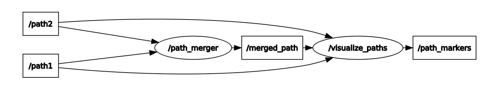

# Path Merger
This repository contains a ROS 2 package that merges two distinct planned path using weighted vector addition and publishes the computed merged path to a new topic. The algorithm is developed using C++ in combination with ROS 2 and using RViz as a visualization environment.

## Description

**Objective:** To perform merging of two input paths into a single, continuous path such that a smooth transitioning between the input paths is ensured and the merged path respects the nature of the original paths.

**System Info:** This package was tested on Ubuntu Linux 20.04 with ROS 2 Foxy.

## Nodes
This package has of 4 nodes and the significance of each is given below, 
1. *input_paths_publisher*: This node reads from a saved path data file of a test scenario to publish the paths as input to the `/path1` and `/path2` topics. The path information comprises of waypoints (array of [geometry_msgs/msg/Point](https://docs.ros2.org/latest/api/geometry_msgs/msg/Point.html)), header ([std_msgs/msg/Header](https://docs.ros2.org/latest/api/std_msgs/msg/Header.html)), and the scenario (*string*) it represents. When running this node, you have to set the ros parameter `test_scenario` to a number to select a test case. More instructions in regards to running the node is described in the Setup section.
1. *path_merger*: This is the main node that subscribes the input paths from the topics `/path1` and `/path2`, performs merging operation, and publishes the resulting path to the `/merged_path` topic. This node remains active after the merging operation is completed and continues to receive new input paths for merging.
1. *visualize_paths*: This is a node that is used for visualization of the input and merged paths. It subscribes to all the path topics, loads the corresponding visual markers with path information, and publishes it to be displayed in RViz.
1. *generate_paths*: This node is only used to generate the path data files for the test cases. The path data is stored in .csv format which contains the path waypoints. Note, this node does not play any role during the merging operation.

**ROS Computation Graph:**



> This figure shows how the above-mentioned nodes interact with each other and the respective topics. This can be viewed by running `rqt_graph` during the runtime.

## Merging Algorithm

The input paths are assumed to be the planned path at two different time instances, more specifically path 1 is the old plan and path 2 is the new plan path. Therefore, merging them in this context means to compute a path that begins as the old path and transitions to the new path. The objective is to ensure smooth transition between the two paths while respecting the waypoints of both. We first find the transition point, a waypoint in path 1 that is closest to the start of the path 2, to begin with the merging operation. Consequently, all the waypoints of path 1 up until the transition point are copied to the merged path. 

As previously mentioned, the working principle of the merging algorithm implemented is weighted vector addition. Since the paths are comprised of discrete waypoints, we only consider two points (current and next index) of a path at every instance to perform the vector addition and iterate over all the points. A vector component is nothing but the line (path) segment between two points. 

> The angle between the path 2 component and the resultant component is represented by $\theta$. We maintain the previous and current values of $\theta$ at every iteration to compute the difference in $\theta$.

Here, path 1 component is the path segment between the current and next index of path 1, similar is the case for path 2 component. The differential compoment is the line segment that points to the next waypoint index of path 2 from the current index of the merged path. Think of it as a vector joining the next index of path 2 and the current index of merged path. Finally, the inertial component is the path segment between the previous and current waypoint index of the merged path. The resultant component is computed by evaluating the following expression,

```math
[\texttt{Resultant}] = \bar{\alpha} . [\texttt{Path 1}] \; + \; (1 - \bar{\alpha}) . [\texttt{Path 2}] \; + \; \bar{\rho} . [\texttt{Inertial}] \; + \; \bar{\delta} . [\texttt{Differential}]
```

> Note, the bar over the weights indicate that they are normalized such that the summation of all weights equal to 1. Thereby, conserving the magnitude of the resultant component.

The idea is to gradually decrease $\alpha$, corresponding to the influence of path 1 component, to zero starting from 1 while keeping $\rho$ and $\delta$ as constants. Thereby, decereasing $\alpha$ increases (1 - $`\alpha`$) that corresponds to gradually increasing the influence of path 2 component in the resultant. The inertial component prevents the resultant from making drastic changes. Lastly, the differential component nudges the resultant towards the path 2 and ensures that the merged path concides with the path 2 (new path). The decrement of $\alpha$ at every iteration is given by,

```math
\alpha^+ = \alpha - \beta - \gamma \;, \quad \quad \quad \gamma \propto \theta_{curr} - \theta_{prev}
```

Here, $\beta$ is a constant parameter iteratively decreasing $\alpha$ by a fixed amount, while $\gamma$ is positive (thus decreasing $\alpha$) if the resultant is diverging, and negative (thus increasing $\alpha$) if converging to the path 2 component.

> $\gamma$ is analogous to the derivative part of a PID controller, thus improves the transient behavior of the resultant and outputs a smoother merged path.

## Test Scenarios
Below are the illustrations of the test scenarios as viewed in RViz, where path 1 and 2 are represented in red and green respectively and the merged path is represented in blue. One can control which path data (continuous line and discrete waypoints) to display in the output by toggling corresponding markers under *Namespaces* of the topic `/path_markers`.

**Scenario 1: Lane Change**

In this test case, we see the old path (path 1 in red) plans to follow the current lane, whereas the new path (path 2 in green) plans to make a lane change. We also notice that the new path doesn't exactly start from a known waypoint in the old path, rather slightly off. However, the algorithm outputs a merged path (blue) that makes a smooth transition between the input paths.

 

> The figure on the top displays only the input paths with the merged path markers toggled off and the figure on the bottom also shows the resulting merged path computed by the algorithm.

**Scenario 2: Right Turn**

Similar to the previous case, we see path 1 (red) plans to follow the current lane, whereas path 2 (green) plans to turn right. For the merged path (blue), we observe that it overshoots slightly when making the right turn. This is due to the effect of inertia preventing to make sharp turns.


**Scenario 3: U-Turn**

Similar to the previous case, path 1 (red) follows the current lane, whereas path 2 (green) takes a U-turn from right. Although the merged path (blue) has a greater overshoot at the turn than scenario 2, we stil see it converging with path 2 near the end. This is due to the effect of the differential component making sure there is no steady-state error.


**Scenario 4: Quick Overtake**

Here, path 1 (red) still follows the same lane but path 2 (green) makes an overtake, where in the process it momentarily changes the lane and quickly returns back to the original lane. This is an interesting test scenario as path 2 makes sudden maneuvers and we can see how the merged path (blue) finds a compromise between smooth transitioning and closesness to path 2.


**Scenario 5: Stop Sign**

In this case, path 1 (red) plans to make a stop in the same lane whereas path 2 (green) plans to make a right turn. The figure below also displays the path waypoints to clearly show path 1's plan to stop.


**Scenario 6: Two Turns**

Unlike the previous test cases, path 1 (red) plans to make a left turn and path 2 (green) plans to make a right turn. From this output, we see that once the merged path (blue) has nearly transitioned to path 2, the nature of path 1 doesn't have any influence over it. Therefore, the merged path places great importance to path 1 waypoints before the transition point and gradually shifts it to the path 2 waypoints with time.


**Scenario 7: Failed Continuity**

In this test case, the waypoint data of the input paths was manually tampered such that it is no longer continuous in nature, which is one of the requirements of the input paths. Therefore, when we run this test scenario, we see an error log in the terminal running the merger node indicating the problem. If either of the input paths fail any of the validity checks, they are rejected and merger node continues to wait for new and valid input paths to merge.

**Scenario 8: Lost Track**

This is an unlikely situation, where the starting point of path 2 (green) is already in a different lane than path 1 (red). For such cases, we skip the merging operation and simply consider the new path (path 2) as the merged path.

> Very rarely, the visualizer node doesn't display the merged path in RViz although the path merger node has published it successfully. In such a case, either relaunch the merger and visualizer nodes or provide a different test scenario only to change it back to the original scenario.

## Setup
This section explains how to install, configure, and use the package. Make sure you have RViz installed along with ROS 2. If not, refer to the [installation of ROS with GUI tools](https://docs.ros.org/en/foxy/Installation/Ubuntu-Install-Debians.html).

> Before you run any of the commands remember to [source your ROS 2 installation](https://docs.ros.org/en/foxy/Tutorials/Beginner-CLI-Tools/Configuring-ROS2-Environment.html) in every new terminal opened so that `ros2` commands will work.

**Installation**

Since this is a package, it is required that you have a ROS 2 workspace. If not, run the following instructions to create a new workspace.
```
mkdir -p ~/ros2_ws/src
cd ~/ros2_ws/src
```

If you already have a ROS 2 workspace, go to the root `src` directory of your desired workspace and run the following commands to install and build the package.
```
git clone https://github.com/shanks-d/path_merger.git
cd ..
colcon build --packages-select path_merger
```

**Configuration**

Update the variable `packageDir` in the [input_paths.cpp](src/input_paths.cpp) with the correct path to the path_merger package in your system. Go to the location where the package is installed and copy the output of `pwd` command.
> Remember to run `colcon build` from the root of your workspace after changing the variable.

**Usage**

To run the *path_merger* node, go to the root of your workspace where the package is installed and execute the following commands,
```
source install/setup.bash
ros2 launch path_merger task_launch.xml
```
>This will run the merger and visualizer nodes and pop open an RViz window for display using the custom [config file](config/rviz_config.rviz) (refer to the next section to manually setup RViz for visualization).

In another terminal, run the *input_path* node by going to the root of your workspace and executing the following command,
```
source install/setup.bash
ros2 run path_merger input --ros-args -p test_scenario:=X
```
> Note, `X` is a placeholder for an integer that you pass to select a particular test case. For e.g., `test_scenario:=2` will load the path data corresponding to the Scenario 2: Right Turn. (Default value of the argument is 1)

If a valid scenario is selected, you should see the input paths and merged path displayed in the RViz window.

To select a new test case, just press `Ctrl+C` to stop the node and re-run the above command with a different test scenario.

**Visualization**
1. Set the *Fixed Frame* to `visualize`.
1. Add -> By Topic -> `/path_markers`.
1. Make sure the *Depth* of the topic is set to 6.
